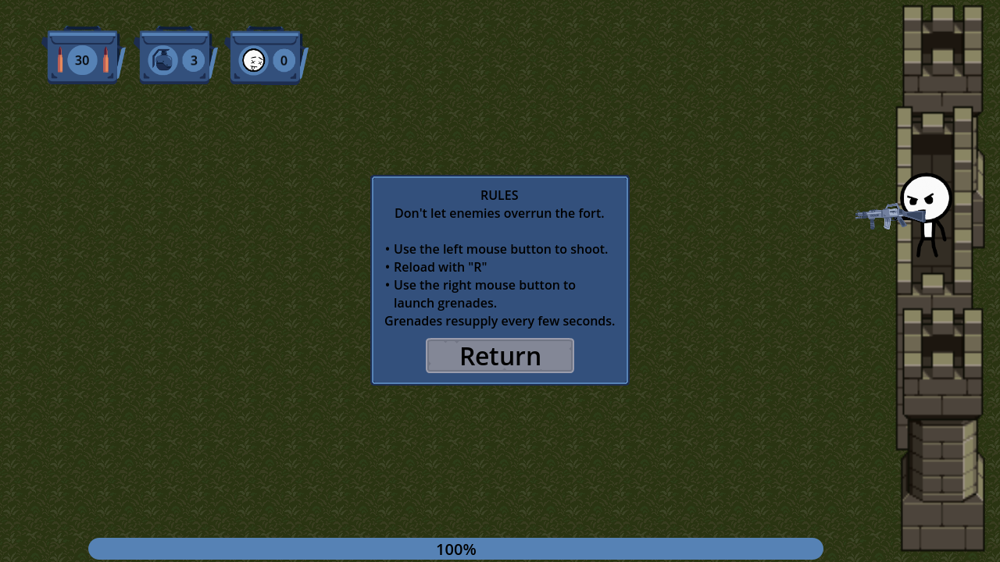

[Play Stickman Fortress]()

### Credits

[Animated Stick Figure Character](https://rgsdev.itch.io/animated-stick-figure-character-2d-free-cc0) by [RGS Dev](https://rgsdev.itch.io/)

[Tower Defense assets](https://opengameart.org/content/tower-defense-prototyping-assets-4-monsters-some-tiles-a-background-image) by [Stephen Challener (Redshrike)](https://opengameart.org/users/redshrike)

[Guns](https://kaylousberg.itch.io/gun-assets) by [Kay Lousberg](https://kaylousberg.itch.io/)

[Blood FX](https://xyezawr.itch.io/gif-free-pixel-effects-pack-5-blood-effects) by [XYEzawr](https://xyezawr.itch.io/)

[UI Pack](https://opengameart.org/content/ui-pack-rpg-extension) and [Crosshair Cursor](https://opengameart.org/content/crosshair-pack-200%C3%97) by [Kenney](https://opengameart.org/users/kenney)

[Explosion FX](https://opengameart.org/content/explosion) by [Cuzco](https://opengameart.org/users/cuzco)

UI SFX: [Menu Selection Click](https://opengameart.org/content/menu-selection-click) by [NenadSimic](https://opengameart.org/users/nenadsimic)

[Gun SFX](https://f8studios.itch.io/snakes-authentic-gun-sounds) by [SnakeF8](https://f8studios.itch.io/)

[Grenade SFX](https://opengameart.org/content/q009s-weapon-sounds) by [Q009, Calinou](https://opengameart.org/users/calinou)

[Enemy Grunts](https://opengameart.org/content/male-gruntyelling-sounds) by [HaelDB](https://opengameart.org/users/haeldb)

[Game Over SFX](https://opengameart.org/content/game-over-game) by [EdenVe](https://opengameart.org/users/edenve)

### Music

[Bossa-Nova](https://opengameart.org/content/bossa-nova) by [Joth](https://opengameart.org/users/joth)

[Two Left Socks](https://opengameart.org/content/two-left-socks) by [congusbongus](https://opengameart.org/users/congusbongus)

[Somewhere in the Elevator](https://opengameart.org/content/somewhere-in-the-elevator) by [You're Perfect Studio](https://opengameart.org/users/youre-perfect-studio)

### Screenshots

